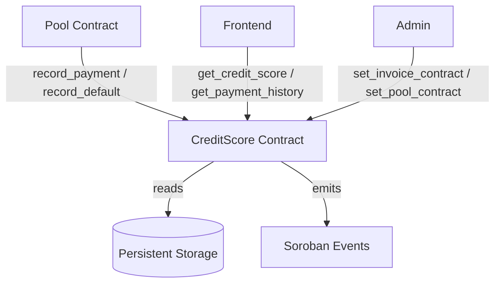

# Design Document: Credit Scoring Mechanism

## Overview

The credit scoring mechanism evaluates SME creditworthiness on the Astera invoice financing platform. It maintains a numeric score in [200, 850] per SME, updated on every invoice repayment or default event. The score is a weighted function of four factors: on-time payment rate, number of completed invoices, total repaid volume, and average payment timing.

The contract already exists at `contracts/credit_score/src/lib.rs`. This design documents the complete intended behavior, identifies gaps in the current implementation, and specifies the correctness properties that must hold.

## Architecture



The Pool contract is the sole authorized caller for write operations. The CreditScore contract is stateful — it accumulates payment records and recomputes the score on every update.

## Components and Interfaces

### Public Functions

| Function | Caller | Description |
|---|---|---|
| `initialize(admin, invoice_contract, pool_contract)` | Deployer | One-time setup |
| `record_payment(caller, invoice_id, sme, amount, due_date, paid_at)` | Pool | Records a repayment, updates score |
| `record_default(caller, invoice_id, sme, amount, due_date)` | Pool | Records a default, updates score |
| `get_credit_score(sme)` | Anyone | Returns full CreditScoreData |
| `get_payment_history(sme)` | Anyone | Returns all PaymentRecord entries |
| `get_payment_record(sme, index)` | Anyone | Returns a single PaymentRecord |
| `get_payment_history_length(sme)` | Anyone | Returns count of records |
| `get_score_band(score)` | Anyone | Returns human-readable band label |
| `is_invoice_processed(invoice_id)` | Anyone | Idempotency check |
| `get_config()` | Anyone | Returns admin, invoice, pool addresses |
| `set_invoice_contract(admin, address)` | Admin | Updates invoice contract address |
| `set_pool_contract(admin, address)` | Admin | Updates pool contract address |

### Internal Functions

| Function | Description |
|---|---|
| `calculate_score(total_invoices, paid_on_time, paid_late, defaulted, total_volume, average_payment_days)` | Pure scoring formula |
| `calculate_average_payment_days(paid_on_time, paid_late, total_late_days)` | Running average helper |
| `get_or_create_credit_data(env, sme)` | Lazy initialization of CreditScoreData |
| `require_admin(env, admin)` | Authorization guard |

## Data Models

### CreditScoreData
```rust
pub struct CreditScoreData {
    pub sme: Address,
    pub score: u32,           // [200, 850]
    pub total_invoices: u32,  // count of all processed invoices
    pub paid_on_time: u32,    // count of PaidOnTime records
    pub paid_late: u32,       // count of PaidLate records
    pub defaulted: u32,       // count of Defaulted records
    pub total_volume: i128,   // sum of all invoice amounts (stroops)
    pub average_payment_days: i64, // mean days early(-) or late(+)
    pub last_updated: u64,    // ledger timestamp of last update
    pub score_version: u32,   // formula version for future migrations
}
```

### PaymentRecord
```rust
pub struct PaymentRecord {
    pub invoice_id: u64,
    pub sme: Address,
    pub amount: i128,
    pub due_date: u64,
    pub paid_at: u64,
    pub status: PaymentStatus,  // PaidOnTime | PaidLate | Defaulted
    pub days_late: i64,         // negative = paid early
}
```

### Scoring Formula Constants
```
MIN_SCORE = 200
MAX_SCORE = 850
BASE_SCORE = 500
PTS_PAID_ON_TIME = 30
PTS_PAID_LATE = 15
PTS_DEFAULTED = -50
PTS_NEW_INVOICE = 5  (applied at 5, 10, 20 invoice milestones)
LATE_PAYMENT_THRESHOLD_SECS = 7 * 24 * 60 * 60  (7 days)
```

### Score Band Thresholds
| Score Range | Band |
|---|---|
| 800–850 | Excellent |
| 740–799 | Very Good |
| 670–739 | Good |
| 580–669 | Fair |
| 500–579 | Poor |
| 200–499 | Very Poor |

## Correctness Properties

*A property is a characteristic or behavior that should hold true across all valid executions of a system — essentially, a formal statement about what the system should do. Properties serve as the bridge between human-readable specifications and machine-verifiable correctness guarantees.*

---

**Property 1: Score bounds invariant**

*For any* combination of payment inputs (any counts of on-time, late, defaulted, any total_volume, any average_payment_days), the score returned by `calculate_score` must satisfy `MIN_SCORE <= score <= MAX_SCORE`.

**Validates: Requirements 1.5, 1.6**

---

**Property 2: Scoring formula monotonicity**

*For any* fixed set of other parameters, adding one more on-time payment must produce a score greater than or equal to adding one more late payment, which must produce a score greater than or equal to adding one more default. Formally: `score(on+1) >= score(late+1) >= score(default+1)`.

**Validates: Requirements 1.2, 1.3, 1.4**

---

**Property 3: Defaults dominate — score below BASE when defaults exceed on-time**

*For any* SME where `defaulted > paid_on_time` and `paid_late == 0`, the computed score must be strictly less than BASE_SCORE (500).

**Validates: Requirements 4.1**

---

**Property 4: Invoice count accumulation invariant**

*For any* sequence of N `record_payment` and `record_default` calls on the same SME, `total_invoices` must equal N after all calls complete.

**Validates: Requirements 2.4**

---

**Property 5: Volume accumulation invariant**

*For any* sequence of payments/defaults with amounts a1, a2, ..., aN, `total_volume` must equal `a1 + a2 + ... + aN`.

**Validates: Requirements 3.4**

---

**Property 6: Running average correctness**

*For any* sequence of payments with days_late values d1, d2, ..., dN (across paid_on_time + paid_late invoices), `average_payment_days` must equal `floor((d1 + d2 + ... + dN) / N)`.

**Validates: Requirements 5.5**

---

**Property 7: Score band coverage**

*For any* score value in [MIN_SCORE, MAX_SCORE], `get_score_band` must return a non-empty string, and the returned band must correspond to the correct threshold range.

**Validates: Requirements 6.1, 6.2, 6.3, 6.4, 6.5, 6.6**

---

**Property 8: Payment history ordering invariant**

*For any* sequence of N record calls, `get_payment_history` must return exactly N records, and `get_payment_record(i)` must return the same record as `get_payment_history()[i]` for all valid indices.

**Validates: Requirements 7.1, 7.2, 7.3**

---

**Property 9: Idempotency guard**

*For any* invoice_id that has already been processed, a second call to `record_payment` or `record_default` with the same invoice_id must panic with "invoice already processed".

**Validates: Requirements 4.3**

## Error Handling

| Condition | Behavior |
|---|---|
| Contract not initialized | `panic!("not initialized")` |
| Already initialized | `panic!("already initialized")` |
| Unauthorized caller | `panic!("unauthorized")` |
| Invoice already processed | `panic!("invoice already processed")` |

## Testing Strategy

### Property-Based Testing

The project uses Soroban's built-in test environment (`soroban-sdk` with `testutils` feature). Since `no_std` Soroban contracts cannot use external PBT libraries like `proptest` directly, property-based tests are implemented as parameterized loops with deterministic pseudo-random inputs using a simple LCG generator seeded within the test. Each property test runs a minimum of 100 iterations.

Each property-based test is tagged with:
```
// **Feature: credit-scoring, Property N: <property text>**
// **Validates: Requirements X.Y**
```

### Unit Tests

Unit tests cover:
- Specific score values at boundary inputs
- Score band threshold boundaries (exact values at 500, 580, 670, 740, 800)
- Authorization rejection for non-pool callers
- Idempotency guard (duplicate invoice_id)
- Initial state for new SMEs

### Test Organization

All tests live in the `#[cfg(test)] mod test` block within `contracts/credit_score/src/lib.rs`, following the existing pattern. The `calculate_score` and `calculate_average_payment_days` functions are tested directly (not through the contract client) for unit-level property tests, since they are pure functions.
